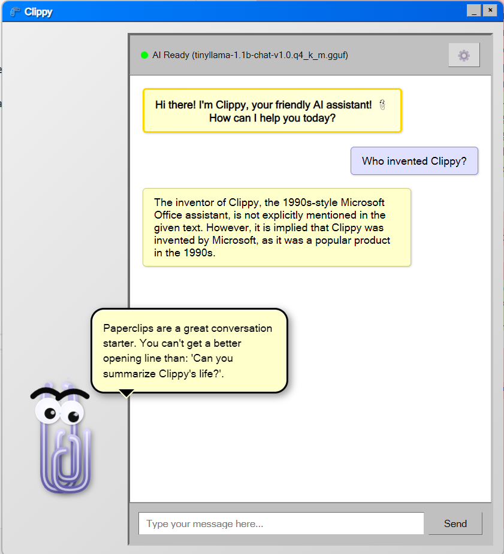

# Clippy AI Assistant 

A nostalgic desktop assistant with a high‑fidelity Clippy and on‑device AI chat powered by node‑llama‑cpp. The app lives in the `clippy-ai/` folder.

<!-- Screenshot placeholder: replace src with your image path -->
<p align="center">
  
</p>

## Project structure
- `clippy-ai/` — Electron app source, scripts, and docs
- `ProductRequirements/` — PRD and requirements docs

## Quick start
```powershell
# From repo root
cd clippy-ai

# 1) Install dependencies
npm install

# 2) Download a starter model (if models/ is empty)
npm run download-model

# 3) Start the app in dev mode
npm start
```


## Build installers
```powershell
cd clippy-ai
npm run build:win   # Windows
# or on macOS/Linux
npm run build:mac
npm run build:linux
```
The build auto‑fetches a default model if none exists and bundles `models/` as an extra resource.

## Notes
- Models: place `.gguf` files in `clippy-ai/models/` and pick them in Settings.
- macOS builds may require signing/notarization for distribution.

## License
MIT
